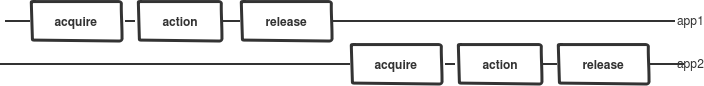
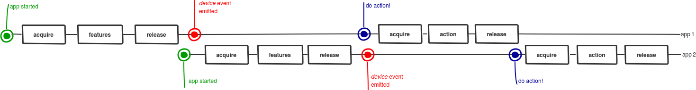
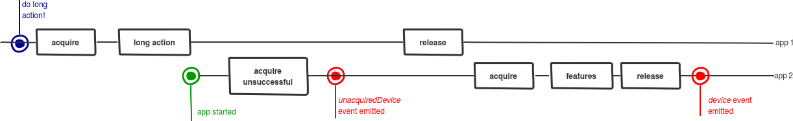
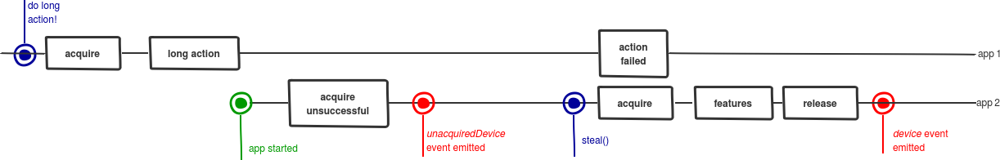
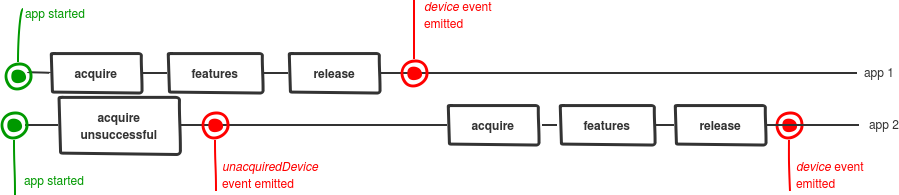
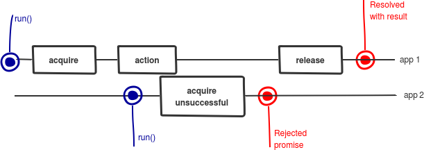
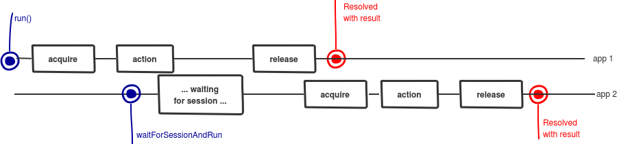
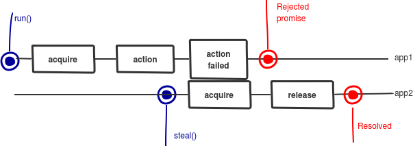

trezor.js API
-----
All the code examples are written with the assumption trezor.js is imported to the `trezor` variable. So, for example
     
     var trezor = require('trezor.js'); // if you are using the npm version

### DeviceList

`DeviceList` is class that lists devices and emits events on any change.

    var list = new trezor.DeviceList();

or

    var list = new trezor.DeviceList(options);

`DeviceList` constructor takes care of initialization of transport layers. `options` is an optional object of key/value pair for configuring. Possible values are:

* `configUrl`: if you want to use your own URL for config file
* `config`: if you want to use your own config file. The value should be a hex string.
* `transport`: if you want to provide your own Transport object (from `trezor-link` module)

The config should be available either on [github](https://github.com/trezor/webwallet-data/blob/master/config_signed.bin), on [Amazon AWS](http://mytrezor.s3.amazonaws.com/config_signed.bin), or on [wallet.trezor.io](https://wallet.trezor.io/data/config_signed.bin). The AWS URL is hardcoded and is used by default, so you don't have to worry about it if you don't want to.

`DeviceList` emits following events:
 
| event | parameters | description |
|-------|------------|-------------|
| `error` | e:&nbsp;Error | Error on either initialization of DeviceList, or any other error. <br><br>If `deviceList.transport` is null, it means transport layer was not initialized and none of the layers are probably installed. You should probably offer user to install either extension or bridge in that case. |
| `transport` | t:&nbsp;Transport | When transport is successfully initialized. |
| `connectUnacquired` | u:&nbsp;UnacquiredDevice | When unacquired device is connected. |
| `connect` | d:&nbsp;Device, previous:&nbsp;UnacquiredDevice | When device is properly acquired.<br>If it was previously being used by someone else, `previous` is the `unacquiredDevice`, otherwise it's null. |
| `disconnect` | d:&nbsp;Device | When a device is disconnected. |
| `disconnectUnacquired` | u:&nbsp;UnacquiredDevice | When an unacquired device is disconnected. |

`DeviceList` has following properties:

* `deviceList.devices` - plain object, with values being the devices available and keys their paths
* `deviceList.unacquiredDevices` - plain object, with values being unacquired devices and keys their paths
* `deviceList.transport` - object, representing transport layer. You might use it in the following way:
    * if it's null, it means no transport layer was yet set up -- or the setup failed (nothing installed).
    * you can look at the `deviceList.transport.version` property, you can read the version as a string


`DeviceList` has following methods:

| method | parameters | return type | description |
|--------|-----------|--------------|-------------|
| `acquireFirstDevice` | rejectOnEmpty&nbsp;?boolean | Promise<Device> | Easiest way of acquiring and getting the first device.<br>First parameter is optional - if true, rejects on empty list. |

See [multitasking](#multitasking) for info on acquiring.

If you don't want to deal with acquired/unacquired/... devices, and you "just" want to use the first TREZOR, you can use the function `deviceList.acquireFirstDevice`, which will take first device currently connected, acquire it and *never* release it, and returns the Device and the Session objects. Other applications will then have to steal it to use it.

### UnacquiredDevice
This class represents a device that cannot be acquired; see [multitasking](#multitasking).

`UnacquiredDevice` emits following events:

| event | parameters | description |
|-------|------------|-------------|
| `connect` | d:&nbsp;Device | This unacquired device was finally acquired and is now a Device. |
| `disconnect` | | This unacquired device was disconnected before it could be acquired. |

`UnacquiredDevice` has following methods:

| method | parameters | return type | description |
|--------|-----------|--------------|-------------|
| `steal` | | Promise<Device> | Stops the action blocking acquiring and returns promise, resolving with the new Device. <br>See [multitasking](#multitasking). |

`UnacquiredDevice` has following properties:

* `unacquiredDevice.path` - path uniquely defines device between more connected devices. It might or might not be unique over time; on some platform it changes, on others a given USB port always returns the same path.

### Device

Device represents the actual TREZOR device. The most important method is `run` (or `waitForSessionAndRun`), which works in a following way:

```
device.run(function callback(session) {
    return session.signMessage([1,2], "message", "bitcoin");
});
```

`device.run` will first do `acquire` (see [multitasking](#multitasking)), then runs the callback function, and waits for the returned promise to resolve or reject. In both cases, it calls `release`.

It is *important* that the callback returns promise and the promise doesn't "hang", so the `release` is correctly called.

Note that the lenght of the action is not tied to the actual device actions. You can do more complex actions - for example, a complete account discovery - before the session is released.

`Session` object itself is described in the next section.

`Device` emits following events:

| event | parameters | description |
|-------|------------|-------------|
| `changedSessions` | isUsed:&nbsp;boolean<br>isUsedHere:&nbsp;boolean | Some change in sessions happened. Either release or acquire.<br>isUsed is true if the device is used (meaning session was acquired), either with this application or elsewhere.<br>isUsedHere is true if the device is used in this application. |
| `disconnect` | | This device was disconnected. |
| `error` | e&nbsp;:Error | Error<br>Can be anything from bad response to user pressing Cancel on device |  
| `send` | type:&nbsp;string, msg:&nbsp;Object | (low level)<br>Message is being sent to Trezor with a given type |  
| `receive` | type:&nbsp;string, msg:&nbsp;Object | (low level)<br>Message is being received from Trezor with a given type |  
| `button` | type:&nbsp;string | User needs to confirm something on the device |
| `pin` | type:&nbsp;string<br>callback:&nbsp;(error: Error, pin: string)=&gt;void | The device asks for PIN.<br>You can either send PIN or send Error back to the device. You need to do one for the flow to continue.<br>PIN is randomized depending on device display; top right is "9", bottom left is "1". "123" means the bottom row on the display. |
| `passphrase` | callback:&nbsp;(error: Error, passphrase: string)=&gt;void | The device asks for passhprase.<br>You can either send passphrase or send Error back to the device. You need to do one for the flow to continue. |
| `word` | callback:&nbsp;(error: Error, word: string)=&gt;void | The device asks for word (on device recovery).<br>You can either send word or send Error back to the device. You need to do one for the flow to continue. |

`Device` has following methods:

| method | parameters | return type | description |
|--------|------------|-------------|-------------|
| run | callback: (Session)=>Promise&lt;X&gt;<br>[options: Object] | Promise&lt;X&gt; | Runs an action on acquired session. Returns promise, that resolves with the same value as the callback result. With no options, the promise is rejected when there is another action running (see [multitasking](#multitasking)). <br><br>The optional option argument changes the behavior. If `options.waiting` is true, we wait for the current action to finish, if there is some. If `options.aggressive` is true, the current action is stopped.  |
| waitForSessionAndRun | callback: (Session)=>Promise&lt;X&gt; | Promise&lt;X&gt; | Equivalent to running `run` with `options.waiting == true`. |
| steal | | Promise | See [multitasking](#multitasking). Equivalent to running `run` with `options.aggressive == true` and an empty function. |
| isBootloader | | boolean | Is device in a bootloader mode? |
| isInitialized | | boolean | Is device initialized? (Meaning, does it have seed loaded) |
| getVersion | | string | Get current firmware version |
| atLeast | version:&nbsp;string | boolean | Compares this firmware version with another version |
| isUsed | | boolean | Is anyone using this device? (Me or other app.) See [multitasking](#multitasking). |
| isUsedHere | | boolean | Am I anyone using this device? |
| isUsedElsewhere | | boolean | Is anyone else using this device? |

`Device` has following properties:
* `device.path` - path uniquely defines device between more connected devices. It might or might not be unique over time; on some platform it changes, on others a given USB port always returns the same path.
* `device.features` - basic information about a device
  * `device.features.label` - name of a device
  * `device.features.pin_protection` - is PIN protection turned on?
  * `device.features.passphrase_protection` - is PIN protection turned on?
  * `device.features.device_id` - a unique ID (is restarted only on device wipe)
  
### Session

`Session` object represents one running session, between acquiring and releasing. All the "actual" calls are done here.

`Session` emits following events (note that they are also re-emitted by `Device` class):

| event | parameters | description |
|-------|------------|-------------|
| `error` | e&nbsp;:Error | Error<br>Can be anything from bad response to user pressing Cancel on device |  
| `send` | type:&nbsp;string, msg:&nbsp;Object | (low level)<br>Message is being sent to Trezor with a given type |  
| `receive` | type:&nbsp;string, msg:&nbsp;Object | (low level)<br>Message is being received from Trezor with a given type |  
| `button` | type:&nbsp;string | User needs to confirm something on the device |
| `pin` | type:&nbsp;string<br>callback:&nbsp;(error: Error, pin: string)=&gt;void | The device asks for PIN.<br>You can either send PIN or send Error back to the device. You need to do one for the flow to continue.<br>PIN is randomized depending on device display; top right is "9", bottom left is "1". "123" means the bottom row on the display. |
| `passphrase` | callback:&nbsp;(error: Error, passphrase: string)=&gt;void | The device asks for passhprase.<br>You can either send passphrase or send Error back to the device. You need to do one for the flow to continue. |
| `word` | callback:&nbsp;(error: Error, word: string)=&gt;void | The device asks for word (on device recovery).<br>You can either send word or send Error back to the device. You need to do one for the flow to continue. |


`Session` has following methods:

| method | parameters | return type | description |
|--------|------------|-------------|-------------|
| typedCall | type:&nbsp;string<br>resType:&nbsp;string<br>message:&nbsp;Object | Promise&lt;Response&gt; | More low-level API. Sends message and returns message of given type.<br><br>Note that while this is low-level, it still doesn't return "intermediary" messages like asking for PIN and passhprase; those are emitted as events by Device and Session. |
| getEntropy | size:&nbsp;number | Promise&lt;Response<br>&lt;{ bytes:&nbsp;string }&gt;&gt;&gt; | random data |
| getAddress | path:&nbsp;Array&lt;number&gt;<br>coin:&nbsp;string<br>display:&nbsp;boolean | Promise&lt;Response<br>&lt;{ address:&nbsp;string }&gt;&gt;&gt; | Gets address with a given path.<br>Coin is the name of coin ("bitcoin", "testnet", "litecoin",...)<br>if `display` is true, the address is displayed on TREZOR and user has to confirm. |
| ethereumGetAddress | address_n:&nbsp;Array&lt;number&gt;<br>display:&nbsp;?boolean | Promise&lt;Response<br>&lt;{ address:&nbsp;string, path:&nbsp;Array&lt;number&gt; }&gt;&gt; | Gets Ethereum address from a given path.<br>if `display` is true, the address is displayed on TREZOR and user has to confirm. |
| verifyAddress | path:&nbsp;Array&lt;number&gt;<br>refAddress:&nbsp;string&nbsp;<br>coin:&nbsp;string&nbsp; | Promise&lt;boolean&gt; | Gets address with the given path, displays it on display and compares to the `refAddress`.<br><br>Note: promise doesn't reject on different result, but resolves with **false**. It rejects on user not confirming on device. |
| getHDNode | path:&nbsp;Array&lt;number&gt;<br>coin:&nbsp;string&nbsp; | Promise&lt;HDNode&gt; | Returns [bitcoin.js HDNode](https://github.com/trezor/trezor-utxo-lib/tree/master/src/hdnode.js) with the given path. (No confirmation needed; it's public node.) |
| wipeDevice | | Promise | Wipes the device (after user confirms). |
| resetDevice | settings:&nbsp;{<br>`strength`:&nbsp;number,<br>`passphrase_protection`:<br>boolean,<br>`pin_protection`:&nbsp;boolean,<br>`label`:&nbsp;string<br>`language`:&nbsp;string<br>`u2f_counter`:&nbsp;number<br>`skip_backup`:&nbsp;boolean } | Promise | Sets a new device. It has to be wiped first. It resolves after user confirms all the words on display. |
| loadDevice | settings:&nbsp;{<br>`strength`:&nbsp;number,<br>`passphrase_protection`:<br>boolean,<br>`pin_protection`:&nbsp;boolean,<br>`label`:&nbsp;string,<br>`mnemonic`:&nbsp;string,<br>`node`&nbsp;HDNode,<br>`payload`:&nbsp;string }<br>network:&nbsp;string | Promise | Loads a device with specific mnemonic and/or HD Node and/or xprv. *Do not use this if you don't need to; use recoverDevice*<br>Either mnemonic, node or payload have to be present. HDNode is an internal TREZOR structure, not bitcoin.js HD Node. |
| recoverDevice | settings:&nbsp;{<br>`word_count`:&nbsp;number,<br>`passphrase_protection`:<br>boolean,<br>`pin_protection`:&nbsp;boolean,<br>`label`:&nbsp;string,<br>`dry_run`:&nbsp;boolean } | Promise | Recovers device. If `dry_run` is enabled performs a dry run of the recovery process and displays result without resetting the device.  |
| clearSession | | Promise | Clears device "session".<br><br>"Session" has nothing to do with Session object or multitasking sessions; clearSession just clears currently remembered PIN and passphrase from device. |
| updateFirmware | payload:&nbsp;string&nbsp;(hex) | Promise | Erases current firmware and loads a new one. |
| signMessage |  path:&nbsp;Array&lt;number&gt;<br>message:&nbsp;string<br>coin:&nbsp;string<br>segwit:&nbsp;boolean | Promise&lt;<br>MessageResponse&lt;<br>address:&nbsp; string,<br>signature:&nbsp;string<br>&gt;&gt; | Signs a message.<br><br> Note: you have to pass the message encoded as HEX<br><br>Coin can be specified as string 'Bitcoin' or 'Litecoin': [source](https://github.com/trezor/trezor-common/blob/master/coins.json) |
| signEthMessage | address_n:&nbsp;Array&lt;number&gt;<br>message:&nbsp;string | Promise&lt;<br>MessageResponse&lt;<br>address:&nbsp; string,<br>signature:&nbsp;string<br>&gt;&gt; | Signs a message using an Ethereum private key.<br><br> Note: you have to pass the message encoded as HEX |
| verifyMessage | address:&nbsp;string<br>signature:&nbsp;string<br>message:&nbsp;string<br>coin:&nbsp;string | Promise | Verifies a signed message. Rejects on wrong signature. |
| verifyEthMessage | address:&nbsp;string<br>signature:&nbsp;string<br>message:&nbsp;string | Promise | Verifies a signed Ethereum message. Rejects on wrong signature. |
| signIdentity | identity:{<br>proto:?string,<br>user:?string,<br>host:?string,<br>port:?string,<br>path:?string,<br>index:?number;}<br>challengeHidden:&nbsp;string<br>challengeVisual:&nbsp;string | Promise&lt;<br>MessageResponse&lt;<br>address:&nbsp;string,<br>public_key:&nbsp;string,<br>signature:&nbsp;string&gt;&gt; | Signs identity<br><br>TODO: write docs here |
| cipherKeyValue | path:&nbsp;Array&lt;number&gt;<br>key:&nbsp;string<br>value:&nbsp;string | Buffer<br>encrypt:&nbsp;boolean<br>ask_on_encrypt:&nbsp;boolean<br>ask_on_decrypt:&nbsp;boolean<br>iv:&nbsp;[iv&nbsp;Buffer] | Promise&lt;<br>Response&lt;<br>{value:&nbsp;string<br>}&gt;&gt; | Encrypts a value on a given key.<br><br>Exact documentation of cipherKeyValue will be in [SLIP-0011](https://github.com/satoshilabs/slips/blob/master/slip-0011.md) - meanwhile, you can check [TREZOR source code](https://github.com/trezor/trezor-mcu/blob/master/firmware/fsm.c#L451-L483). |
| changeLabel | label:&nbsp;string | Promise | Changes label. |
| togglePassphrase | enable:&nbsp;boolean | Promise | Turns the passphrase on/off. |
| changeHomescreen | picture: string (hex) | Promise | changes the homescreen. |
| signBjsTx | info:&nbsp;TxInfo<br>refTx:&nbsp;Array&lt;Transaction&gt;<br>nodes:&nbsp;Array&lt;HDNode&gt;<br>coinName:&nbsp;string<br>network:&nbsp;bitcoin.Network | Promise&lt;Transaction&gt; | Signs transaction after asking user on the device.<br>The name is `signBjsTx` for backwards compatibility, meaning "sign Bitcoin.js transaction", since it accepts and returns blockchain.js data structures.<br><br>The parameters are explained under this table. |
| signEthTx | address_n:&nbsp;Array&lt;number&gt;<br>nonce:&nbsp;string<br>gas_price:&nbsp;string<br>gas_limit:&nbsp;string<br>to:&nbsp;string<br>value:&nbsp;string<br>data:&nbsp;?string<br>chain_id:&nbsp;?number | Promise&lt;EthereumSignature&gt; | Signs Ethereum transaction after asking user on the device. |
| backupDevice | | Promise | Initiates the display of recovery mnemonic, works only for devices with needs_backup `true`, sets needs_backup to `false`|


`Response<X>` is an object with type `{type: string, message: X}`.

##### signBjsTx parameters
TxInfo is an object with:

* inputs: Array&lt;InputInfo&gt;
* outputs: Array&lt;OutputInfo&gt;

InputInfo is an object with:
* hash: Buffer
  * note that, as in Bitcoin.js structures, the hash is **reversed** from the transaction IDs!
* index: number
* path: Array<number> | null
  * present, if the input is from TREZOR

OutputInfo is an object with:
* value: number
* path: Array<number> | null
* address: string | null
  * either path or address must be present

refTxs are bitcoin.js transations, that are referenced in the inputs. You need to put all the transactions which are referenced in any of the inputs!

nodes is an array of Bitcoin.js HDNodes for addresses, with indexes being the index of the nodes. So, most often, `[externalChainHDNode, changeChainHDNode]`. 

coinName is "bitcoin", "litecoin", "dash", ...

network is network for Bitcoin.js. If it's not present, trezor.js tries to find it by coinName in bitcoin.js table.

### Multitasking

More applications can, in general, work with the same TREZOR; however, they cannot perform actions with the device at the same time. 

We use a "cooperative multitasking". Trezor.js does an "acquire" command to transport layer before any action, and after the action calls a "release". This is done transparently by trezor.js, so the app doesn't have to call the commands explicitly; however, it's important to keep the multitasking model in mind to understand various call results.

##### Multitasking flow



This image illustrates the flow. The left-right axis represents time; the two lines represent two applications, that both use trezor.js.

##### Ideal case



Connected device needs to do the acquire-release flow - before the `Device` object is even created (!) - in order to read some basic information about the device. Only then, the `device` event is being emitted by `DeviceList`.

This image illustrates a case, when there is no conflict between applications.

##### Waiting for initialization



The first application can be in the middle of a long action (for example, a long transaction signing, or waiting for confirmation on a device) when the second application starts. In that case, `Device` object cannot be immediately created, since it cannot run acquire.

The `Device` object creation has to wait until the action is finished. `DeviceList` first emits `unacquiredDevice`, and only after the first application action finishes, the `device` event is emitted. Note that this happens automatically.

##### Stealing before initialization



The first application does *not* have to finish the action (it might be stuck - the tab could be frozen, or perhaps there is a bug in the application, or perhaps user forgot about the tab). You can explicitly call `steal()` on the `UnacquiredDevice` object, which will stop the first application action and automatically acquire the device. 

Note that you should only do `steal` when user explicitly asks for it - you don't want to stop other application from finishing its task, if it's not necessary.

##### Two concurrent acquires



Often, two acquires happen at the same time. 

If you have two application open at the same time and one device is connected, both will try to call `acquire` at the same time. 

Only one of those two acquires immediately succeed. The second application will first get `unacquiredDevice` event, and very quickly afterwards `device` event.

##### Running concurrent actions - default case


If you try to use `run()` on `Device` while other application has acquired the device, the call will immediately fail and the `run` will return rejected promise, while the first action will continue running.

You can tell the status by calling `isUsedElsewhere()`, which returns boolean, see below.

Note that not even *single application* can run two actions at the same time. If you try to `run()` two actions at the same time, the second will fail. You can use `isUsedHere()` to detect the status of your application using the device.

##### Running concurrent actions - waiting


If you use `waitForSessionAndRun()` on `Device` while other application has acquired the device, the call will wait until the other application called `release` and only *then* will happen.

Note that if the first application is frozen, the second application never gets to use the device.

Note that `waitForSessionAndRun()` also works within a single application.

##### Stealing


Instead of waiting for session, you can actively stop the other action by using `steal()`. 

Stealing will not actually "give you" the session; however, it will stop the first action, allowing you to use `run()` immediately.

##### Strategies
Depending on how much complex do you want to make your application, you might use some of the following strategies.

If you want a simple application, you might want to either ignore `unacquiredDevice` events entirely, or, conversely, just immediately call `steal()` at the `UnacquiredDevice` objects. If you want a more robust application, you might want to offer the user the possibility to call `steal()` if the device stays unacquired for too much of a long time.

Similarly, if you want a simple application, you might want to either just call `waitForSessionAndRun` or, conversely, just call `steal` whenever the device is used and you want to run some action. If you want a more robust application, you might want to detect when the device is being used elsewhere and offer the user the possibility to call `steal()`.

